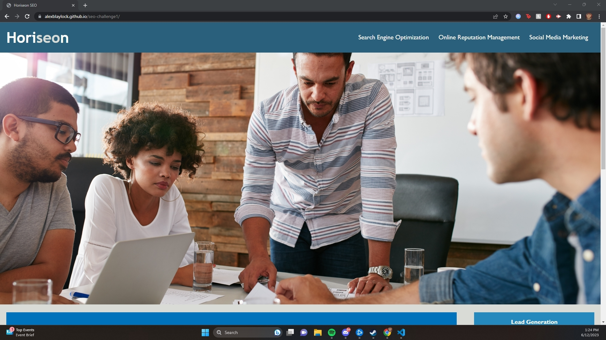
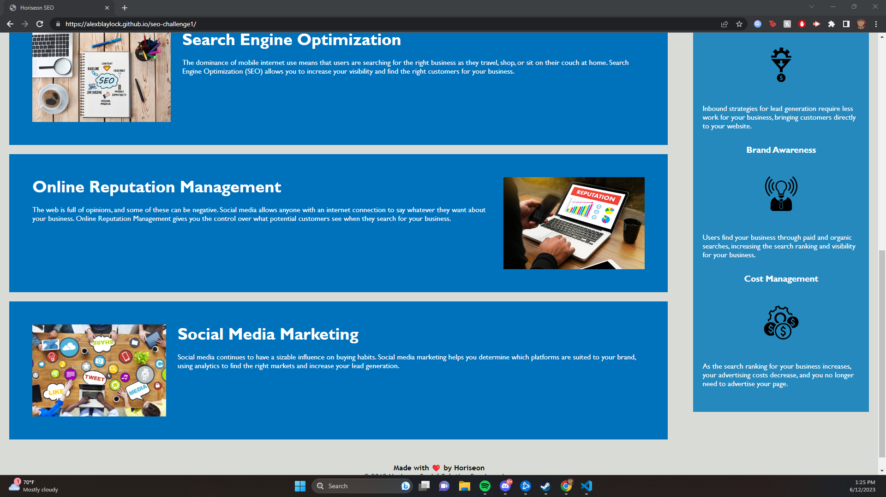

Horiseon, Search Engine Optimization (Challenge 1)

Horiseon is a project that is focused on help provide information on how to optimize your website, and help accessibility. It is also showcases how important social media presence is, whether it be through marketing or just having a good image online. Having a well optimized website makes it easy for you to achieve your goal with your website, which in turn increases consumer happiness, which in turn helps growth.

References used to help me with my code:
https://www.washington.edu/accesscomputing/webd2/student/unit2/common_tags.html
I also used the reference code to compare my code to the reference.

Screenshot of my page:

Link to my Github Page:
https://alexblaylock.github.io/seo-challenge1/

Link to my Repository:
https://github.com/AlexBlaylock/seo-challenge1

Thank you to others in my class who I studied with, in particular:
Joy Yiseo
Emily Caton
Jack Stendeback

Also thank you to Tom Hearne and Matt Bronstein for teaching the class.